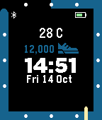
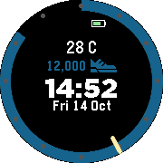
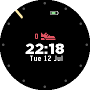

# Strides++


This watchface is a "enhanced" version of pebble [Stride](https://apps.getpebble.com/en_US/application/56b15c5c9c4b20ed5300006c) watchface. Changes include:
* Icon to show phone connection status.
* Battery icon. Charge is shown as solid bar. When charging will show a different icon.
* Date
* When connected/disconnected from the phone will vibrate
* The Daily average where replaced with a goal.
* Local weather
* Daily goal is configurable

## Peble Time


## Pebble Round


## Peble and Pebble 2


You need to add weather support before the App can be compile. Run the following command in the terminal

```$pebble package install pebble-generic-weather```

The code is based on [Mitchell Roy](mailto:mitchell@pabble.com) and [Chris Lewis](mailto:Bonsitm@gmail.com) [health-watchface](https://github.com/pebble-examples/health-watchface.git). Health-watchface is a reference copy of the official pebble Stride health watchface.
